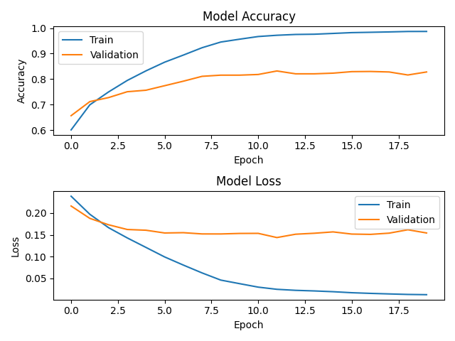

## This is the BiLSTM + Attention model.

- The training platform is Colab.

- The total number of data = 323366

- The number distribution of Train:Dev = 8:2 with dropout and Epoch: 30


## Result 

- Average eval_accuracy by three times experiments: 0.78




## Usage:
#### Training:
`python train.py --plot_training`

#### Evaluate:
`python evaluate.py`

model [pretrained](https://drive.google.com/drive/u/2/folders/1-Bqhk814nCpYTifg66SKFNK1m6yCs_1T)
## Reference
The code is referred from the following link:

- https://github.com/likejazz/Siamese-LSTM

- https://github.com/LuJunru/Sentences_Pair_Similarity_Calculation_Siamese_LSTM

Here are the key code for the normal attention from the above link (https://github.com/LuJunru/Sentences_Pair_Similarity_Calculation_Siamese_LSTM).

```
def shared_model(_input):
    # Word embedding
    embedded = Embedding(len(embeddings), embedding_dim, weights=[embeddings], input_shape=(max_seq_length,),
                         trainable=False)(_input)

    # Multi-layer Bi-LSTM
    activations = Bidirectional(LSTM(n_hidden, return_sequences=True), merge_mode='concat')(embedded)
    activations = Bidirectional(LSTM(n_hidden, return_sequences=True), merge_mode='concat')(activations)

    # Dropout
    activations = Dropout(0.5)(activations)

    # Attention
    attention = TimeDistributed(Dense(1, activation='tanh'))(activations)
    attention = Flatten()(attention)
    attention = Activation('softmax')(attention)
    attention = RepeatVector(n_hidden * 2)(attention)
    attention = Permute([2, 1])(attention)
    sent_representation = multiply([activations, attention])
    sent_representation = Lambda(lambda xin: K.sum(xin, axis=1))(sent_representation)

    # Dropout
    sent_representation = Dropout(0.1)(sent_representation)

    return sent_representation
```
